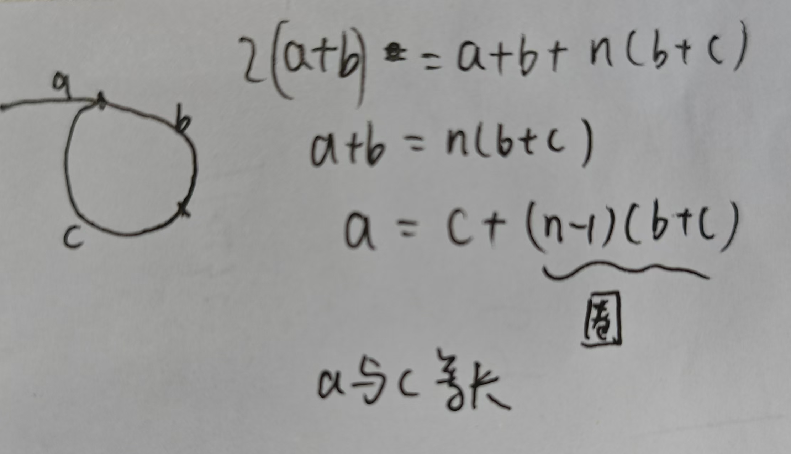

# 链表

### 203. 移除链表元素

* 如果不引入虚拟头节点的话。需要区分头节点的处理方式和中间节点的处理方式。
* 如果引入虚拟头节点，一切都可以按照中间节点的处理方式。

### 707. 设计链表
可以自己创建一个数据结构ListNode，我可太牛逼了直接再MyulinkedList上梭哈
自己创一个ListNode的话，那就可以存size了，时间复杂度会友好！同样也可以存一个vhead，一切都变得很顺利
注意细心一点，以后可以重复练练

### 206. 反转链表
1. 每次对接两个节点，一个pre，一个cur
2. cur.next预先存起来
3. 从第一个元素开始，也就是pre=null, cur=head 
4. 到最后元素的后一个结束，也就是pre=lastnode, cur=null 

### 24. 两两交换链表中的节点
比较简单，要处理1和2的话，就要找到0
1. 注意.next.next的有效性判断，避免空指针异常

### 141. 环形链表
此题实际上是一个数学题。可以通过简单的画图推导发掘关系。
1. 有环 --> 快慢指针会相遇
2. 入口 --> a从相遇处开始，b从head开始，两个一步步走，终究会在入口处遇见 （由画图推导得来的关系）

### 19. 删除倒数第n个节点
找倒数第n个，可以通过快慢指针法来找，快指针先移动n步，然后快慢指针同时移动直至快指针移动到末尾。
1. 要删倒数第n个，那么最终应该找到倒数第（n+1）个节点！


### 707. 设计链表
- 描述：实现链表的基本操作，必做题
- 注意：其实没啥，主要是有很多边界情况要多次提交，哪里错补哪里


### 83. 删除排序链表中的重复元素
- 描述: 链表[1,1,2] -> [1,2]
- 注意：一旦遇到下一个和下下个值一样，那就跳过下下个，直接指向下下下...

### 82. 删除排序链表中的重复元素II
- 描述: 链表[1,1,2] -> [2]
- 注意：一旦遇到下一个和下下个值一样，那就一直删除到不一样为止

### 206. 反转链表
- 描述：整个链表反转[1,2,3,4,5] -> [5,4,3,2,1]
- 实现：pre=null, cur=head，然后一个个逆向
- `nxt = cur.next` `cur.next = pre` `pre = cur` `cur = nxt`

### 92. 反转链表II
- 描述：反转部分链表[1,2,3,4,5] -> [1,4,3,2,5]
- 实现：找反转区域，区域内以206的思路反转
- 注意：最后拼接最好画个图 `allPreNode.next.next = allEndNode` `allPreNode.next = pre`
    
### 141. 环形链表
- 描述：判断链表是否有环
- 实现：快慢指针，快指针走两步，慢指针走一步
  `while(fast&&fast.next){...}` 无环会跳出，有环相遇判断跳出

### 142. 环形链表II
- 描述：判断并返回环形链表的入口节点
- 实现：在141的基础上，从相遇点开始，再派一个指针从头出发，和慢指针同时出发，他俩相遇点就是入口
  

### 19. 删除链表的倒数第N个节点
- 快慢指针，注意索引

### 876. 链表的中间节点
- 快慢指针，注意索引

### 2. 两数相加
- 描述：这种题目都不可能转为number再相加，只能按digit相加进位
- 实现：两个链表同时遍历，注意进位的处理，外置一个carry变量，每次都更新
  ```js
    let cur1 = l1, cur2 = l2
    let head = new ListNode(-1)
    let cur = head
    let carry = 0 // 进位 !

    while (cur1 || cur2 || carry) {

        // 算好digit和carry
        const val1 = cur1 ? cur1. val : 0
        const val2 = cur2 ? cur2. val : 0
        const sum = val1 + val2 + carry
        carry = sum / 10 | 0
        const digit = sum % 10

        cur.next = new ListNode(digit)
        cur = cur.next

        if (cur1) cur1 = cur1. next
        if (cur2) cur2 = cur2. next
    }

    return head.next
  ```

### 146. LRU Cache

哈希表 + 双向链表 + 静态dummyHead/Tail