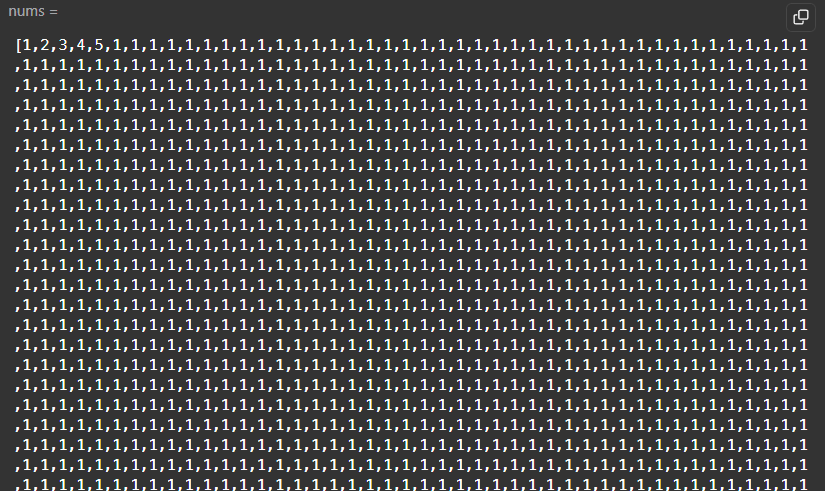

# 数组
# 二分查找
## [$704 二分查找 ](https://leetcode.cn/problems/binary-search/)
### 关键点
从始至终遵循同一个数组边界定义，左闭右开 | 左闭右闭

# 双指针
## [$27 移除元素 ](https://leetcode.cn/problems/remove-element/description/)
### 关键点
对**快慢指针**的理解：
快指针 -- 查找，哨兵
慢指针 -- 实际赋值处，操作结果数组

## [$977 有序数组的平方 ](https://leetcode.cn/problems/squares-of-a-sorted-array/description/)
### 关键点
题目的特殊性，升序排列，有负数的话，那平方最大的数字肯定是从两端到中间逼近的。所以可以通过双指针向中间逼近，一步步获取最大值、次大值......

## [$209 长度最小的子数组 | 滑动窗口](https://leetcode.cn/problems/minimum-size-subarray-sum/description/)
### 关键点
两重循环的话不用说，外循环起点，内循环终点，遍历所有可能的情况
滑动窗口是关键，题目中，说明了数组中每个元素都是正整数，所以带来了某些隐藏条件，就比如，起点终点之间的元素和总是窗口越宽越大，因为加的都是正整数，所以就可以用滑动窗口的思想

1. 移动窗口的右侧（终点指针）
2. 如果满足条件，再尝试移动窗口的左侧（起点指针）一直移动找到该终点指针下的最小窗口宽度。
3. 重复（1）（2）


## [$59 螺旋矩阵](https://leetcode.cn/problems/spiral-matrix-ii/description/)
### 关键点
循环不变量：
1. 每次都是处理一圈，从外圈一点点到内圈。
2. 每一圈都是处理四条边，每条边都是处理0到末尾前一个。
3. 利用offset来控制每一圈的偏移量。


### 66. 加一
- 描述：一个数组，表示一个大整数，加一，返回加一后的数组
- 实现：
  - 取个位，若<9，个位加一返回
  - 考虑进位，可以提前unshift一个0，倒着遍历，实现进位
  - 最后返回的时候有必要的话把第一个0去掉

### 724. 寻找数组的中心下标
- 描述：求一个下标I，使得[0-I-1]的和等于[I+1-n]的和
- 实现：
  - 初始化I为0，left=0,right = sum - nums[0]
  - 向右遍历，left += nums[I],right -= nums[I+1]

### 189. 轮转数组
- 描述：把一个数组，向右轮转k个位置，有点像环形链表的感觉
- 实现：
  - 整个数组翻转，后面的就到前面了
  - 翻转前k个，轮转的K个就对了
  - 翻转后n-k个
- 注意：
  - 当k>n时，k=k%n

### 48. 旋转图像
- 描述：把一个N*N矩阵，顺时针旋转90度
- 实现：
  - 元素(i,j)的旋转规律为`(i,j) -> (j,n-i-1)`
  - 在一圈的元素中，遍历一行的n-1个元素，然后进行循环交换 a->b->c->d->a
    - `(i,j) -> (j,n-i-1)`, 同样的, 通过代入可得，`(j,n-i-1) -> (n-i-1,n-j-1)`....
- 注意：
  - 一层一层的向内旋转，那么外层遍历层数为`n/2 | 0`
  - 每一层遍历的元素为`level, n-level-1`

### 54. 螺旋矩阵
- 描述：给定一个m*n的矩阵，按照顺时针螺旋顺序遍历，返回矩阵中的所有元素
- 实现：
  - 一层层遍历，外层循环遍历层，层数 = `min(m,n) / 2 | 0`
  - 循环体内部分别处理四条边，注意左闭右开
  - top: 从左到右遍历列`[layer, n-layer-1)`
  - right: 从上到下遍历行`[layer, m-layer-1)`
  - bottom: 从右到左遍历列`[n-layer-1, layer)`
  - left: 从下到上遍历行`[m-layer-1, layer)`
- 注意处理奇数边，容易遗漏
  - if `min(m,n) % 2 === 1` 或 `layerNum === 0`
  - 可能是剩下单独一行 `[layer, n-layer)`
  - 可能是剩下单独一列 `[layer, m-layer)`

### 498. 对角线遍历
- 描述：给定一个m*n的矩阵，按照对角线顺序遍历，返回矩阵中的所有元素
- 实现：
  - 不要想着按层或者按条去遍历，而是从`[0,0]`开始，走一步看一步
  - 规律：i+j 为偶数时，向右上走，i+j 为奇数时，向左下走
- 注意：
  - 边界比较多，往右上走时，需要考虑在第一行，在最后一列的情况
  - 往左下走时，需要考虑在最后一行，在第一列的情况

### 快速排序
- 时不时得写一下，容易忘记
- 要点：
  - 一个核心函数：实现pivot前面的都小于pivot，pivot后面的都大于pivot，返回pivot的index
    - 我习惯于取第一个元素为pivot
    - 从后往前遍历j，`>=`时，`j--`，找到第一个小于pivot的元素
    - 然后从前往后遍历i, `<=`时，`i++`，找到第一个大于pivot的元素
    - 交换i和j的元素
    - 最后i和j相遇跳出循环，把arr[0]和arr[i]交换。

  - 一个调度函数：递归调用，基于pivot的index，递归自调用

### 167. 两数之和II
- 描述：给定一个升序数组，找到两个数，使得它们相加之和等于目标数
- 实现：
  - 双指针，一个从左到右，一个从右到左
  - 因为是升序的了，sum > target 时，右指针左移，sum < target 时，左指针右移
- 注意：
  - 返回的下标需要 + 1

### 125. 验证回文串
- 描述：给定一个字符串，去除非字母数字的字符，大写转小写，判断它是否是回文串
- 注意：
  - 记得字符串大小写转换 `toLowerCase()` `toUpperCase()`

### 11. 盛最多水的容器
- 描述：给定一个height数组，height[i]和height[j]组成一个容器，求容器中能盛最大容量
- 实现：
  - 容量：`(j-i) * min(height[i], height[j])`
  - 用一个变量记录最大容量，在遍历过程中更新
  - **对撞**指针，**移动高度小的指针**，让拖后腿的加把劲


  - 面积 = 两个指针的距离 * 两个指针中较小的值
  - 移动指针，移动较小的值的指针

### 26. 删除有序数组中的重复项
- 描述：给定一个非递减数组，删除重复项，返回新的长度
- 实现：
  - 快慢指针，快指针遍历，慢指针记录非重复项
  - 快指针遍历到非重复项，慢指针就赋值


### 1343. 大小为K且平均值大于等于阈值的子数组数目
- 描述：给定一个数组和一个阈值，求长度为K，且平均值`>=`阈值的子数组数目
- 实现：
  - 子序列问题，考虑滑动窗口实现，不用记录元素，只需要记录窗口内元素的和
  - 这个结构特别好，很清晰
  ```js
    let left = 0, right = 0
    while(right < arr.length) {
      window.push(arr[right])
      
      if(right - left + 1 > windowSize){ // 定长窗口
        
        // 维护和更新求解的答案...

        window.shift()
        left++
      }

      right++
    }

  ```

### 3. 无重复字符的最长子串
- 描述：求一个字符串中，不含重复字符的最长子串的长度
- 实现：
  - 子串问题，滑动窗口实现，这题的核心是不含重复元素的判断
  - 可以用数组，每次用`indexOf`判断
  - 可以用Map, Set, 每次用`has`判断, 因为不需要放什么值，所以用Set即可
  ```txt
    1. 考虑塞入s[right], 先清理再塞入，清理的时候就是窗口收缩
    2. 考虑求解目标，维护ans
    3. right ++
  ```


### 215. 数组中的**第K个**最大元素
- 描述：给一个数组，求数组中第K大的元素
- 注意：本题测试案例贼TM搞，第41是一个包含几万个重复元素的，导致常规的快速选择**二路划分**会超时
  - 
- **快速选择**实现
  - 超时版：虽然pivot是随机选的，但是当数组中元素大部分相同时，会退化成O(n^2)
  ```js
   function qkSelect(nums, left, right, targetIndex) {
       if (left == right) return nums[left] 
       const randomIndex = Math.floor(Math.random() * (right - left + 1)) + left;
       [nums[left], nums[randomIndex]] = [nums[randomIndex], nums[left]]
       const pivot = nums[left]
       let i = left, j = right  
       while (i < j) {
           // 前小后大
           while (i < j && nums[j] >= pivot) j--
           while (i < j && nums[i] <= pivot) i++  
           if (i < j) [nums[i], nums[j]] = [nums[j], nums[i]]
       }
       nums[left] = nums[i]
       nums[i] = pivot  
       if (targetIndex == i) return nums[targetIndex]
       if (targetIndex > i) return qkSelect(nums, i + 1, right, targetIndex)
       else return qkSelect(nums, left, i - 1, targetIndex)
   }
  ```

  - 优化版: 三路划分[小于pivot, 等于pivot, 大于pivot]三个区间

  ```js
    function qkSelect(nums, left, right, targetIndex) {
      if (left >= right) return nums[left]

      const pivot = nums[left]

      // 三路划分
      // 此时 [left, lt) < pivot, [lt, gt] == pivot, (gt, right] > pivot
      let lt = left, gt = right, i = left + 1

      while (i <= gt) {
          if (nums[i] < pivot) {
              [nums[i], nums[lt]] = [nums[lt], nums[i]]
              lt++
              i++
          } else if (nums[i] > pivot) {
              [nums[i], nums[gt]] = [nums[gt], nums[i]]
              gt--
          } else {
              i++
          }
      }

      // 判断 targetIndex 是否落在等于区
      if (targetIndex >= lt && targetIndex <= gt) {
          return nums[targetIndex]
      } else if (targetIndex < lt) {
          return qkSelect(nums, left, lt - 1, targetIndex)
      } else {
          return qkSelect(nums, gt + 1, right, targetIndex)
      }
    }

  ```

- **堆排序**实现
  - 建一个小顶堆，可以维护一个**大小为k**的小顶堆
  - 建堆时，如有空间，就直接入堆
  - 如果无空间，**判断当前元素是否大于堆顶**，大于就pop堆顶，然后入堆
  - 最后，整个堆就是整个数组中前k个最大的，堆顶就是第k大的元素

  - 注意，把**小顶堆**写成一个*类*是最舒服的，核心函数`_up`和`_down`，写成递归的最舒服
  - 注意, 维护一个k的小顶堆, 是在外部建堆的时候做的事情。
  ```js
    class MinHeap {

        constructor() {
            this.heap = []
        }

        _up(id) {
            if (id == 0) return

            const fatherId = (id - 1) / 2 | 0
            if (this.heap[fatherId] > this.heap[id]) {
                // swap and up
                [this.heap[fatherId], this.heap[id]]
                    = [this.heap[id], this.heap[fatherId]]

                this._up(fatherId)
            }

        }

        _down(id) {
            if (id >= this.heap.length) return

            let leftID = id * 2 + 1
            let rightID = id * 2 + 2
            let smallestID = id

            if (leftID < this.heap.length && this.heap[smallestID] > this.heap[leftID]) {
                smallestID = leftID
            }
            if (rightID < this.heap.length && this.heap[smallestID] > this.heap[rightID]) {
                smallestID = rightID
            }

            if (smallestID != id) {
                // swap and down
                [this.heap[smallestID], this.heap[id]]
                    = [this.heap[id], this.heap[smallestID]]

                this._down(smallestID)
            }

        }

        peek() {
            return this.heap[0]
        }

        insert(num) {
            this.heap.push(num)
            this._up(this.heap.length - 1)
        }

        shift() {
            if (this.heap.length == 0) return null
            if (this.heap.length == 1) return this.heap.pop()

            const res = this.heap[0]
            const last = this.heap.pop()
            this.heap[0] = last

            this._down(0)
            return res
        }

    }

    var findKthLargest = function (nums, k) {

        const minHeap = new MinHeap()

        for (let num of nums) {
            if (minHeap.heap.length < k) minHeap.insert(num)
            else if (num > minHeap.peek()) {
              // 这里是重点，只有当当前num比堆顶大的时候，才入堆
              // 这样最终我们的堆里才是最大的k个数
                minHeap.shift()
                minHeap.insert(num)
            }
        }

        return minHeap.peek()
    };


  ```
  
  
