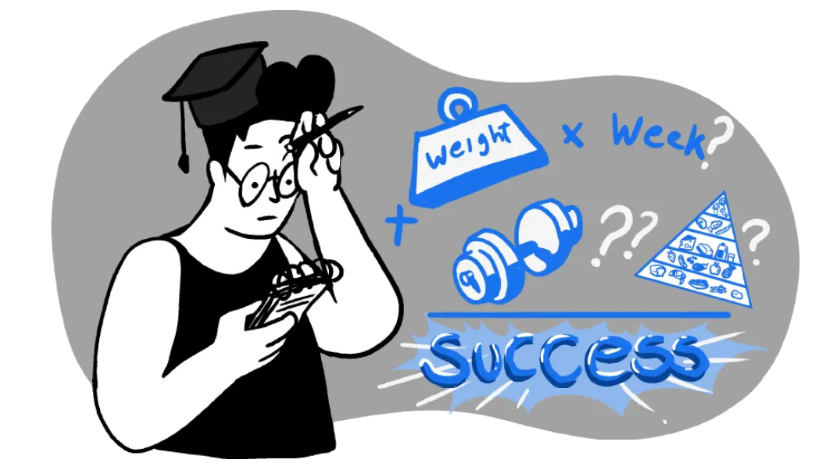
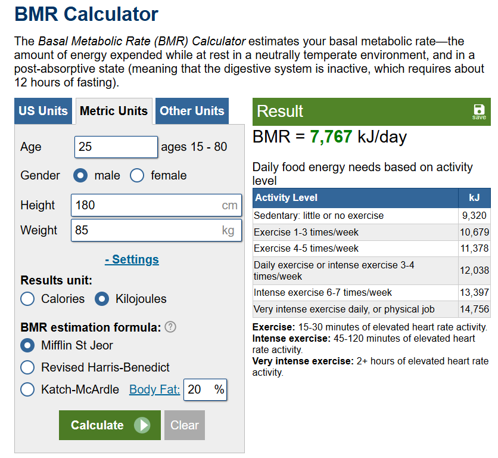
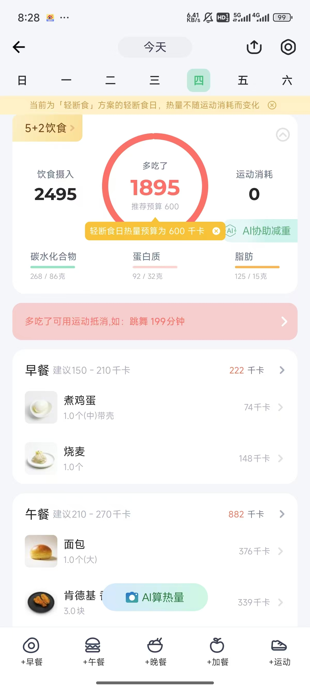

> 前两天在宿舍用舍友的电子秤称了一下，非常的夸张/(ㄒoㄒ)/~~。肚子确实肉眼可见的大了，每天清晨空腹的状态还可以自我感觉良好，可谓“不称不知道，一称吓一跳”。以后要少吃，多运动。这里记录和学习一下科学减肥

## 减肥的核心：热量赤字
热量赤字 ==> **calories in** < **calories out**

小明一天需要2000大卡维持正常生活，他每天摄入1800大卡，那么就有200大卡的赤字，那么他就会瘦下来。

小李一天需要2000大卡维持正常生活，他每天依然摄入2000大卡，但他通过额外的体育活动消耗200大卡，那么他也就会瘦下来。

---

## Step 1: Figure Out Maintenance Calories

先明确自己每天需要多少热量来维持正常生活，这个热量被称为**基础代谢率**（Basal Metabolic Rate, BMR）。   
BMR是维持生命所需的最小热量，不考虑运动。    
TDEE（Total Daily Energy Expenditure）是维持生命所需的总热量，考虑运动。     
`TDEE = BMR + 活动消耗 + 食物热效应（TEF）`

---

这是一个非常简单的计算器，输入性别、年龄、身高、体重，计算BMR。
[BMR计算器](https://www.calculator.net/bmr-calculator.html)

这里边有几个模型，不过都大差不差，我选择的是Mifflin St Jeor模型。

---

如图，我的BMR是1755大卡/天，7348千焦/天，`1000千焦=238. 9大卡`，不过我看国内很多地方都是用千焦来计算，所以以下以千焦（KJ）为准。

右侧也写了，在我不同`Activity Level`下的TDEE。

| 活动水平 | 描述 | TDEE(KJ) |
|---------|------|----------|
| 久坐不动 | 几乎不运动 | 8801左右 | 
| 轻度活动 | 每周运动1-3次 | 10500左右 |
| 中度活动 | 每周运动3-5次 | 12000左右 |
| 重度活动 | 每周运动6-7次 | 13000左右 |

久坐不动和轻度活动是我的常态了，所以我的TDEE是9000左右，不右！就纯左好吧

## Step 2: Track Calories & Access Eating Habits

1. 用手机APP记录饮食，明确热量摄入

    翻了翻应用市场，我选择的是[薄荷健康](https://www.baomihu.com/)，因为可以记录运动，而且有食物库，可以计算热量。
    ---
    填了基本身体信息和减肥目标后，给我制定了个 `5+2轻断食计划`，真好啊...

    然后我试着把今天吃的东西给记录了一下，绷不住了，狠狠超标。
    

    不过不知道为啥今天恰好是轻断食日，所以热量摄入是600大卡左右。这也太夸张，就算我中午只吃一个鸡翅也是超标的。
        
    和女朋友讨论过后，她说轻食影响脑子.
        
    那我就不管这轻断食了，正常少吃谢，继续保持记录！

2. 分析饮食习惯

    - 我的个人饮食习惯
    - **来者不拒**： 出去下馆子也好，零食，蛋糕，饮料，奶茶都是来者不拒。
    - **不想浪费**： 不管现在是几分饱，只要碗里还有，都要吃完，不可浪费！

    - Result
    - 多吃食堂的快餐蛮好！便宜，而且蔬菜和肉都有些！
    - 吃啥都是，要记得点到为止，不要硬撑着吃！
    - 少吃零食，蛋糕，饮料，奶茶，多喝水多吃蔬菜水果！

## Step 3: Create a Calorie Deficit

创造卡路里赤字，不用说了，一句话，少吃，多动。

## Step 4: Limit Sugar & Refined Carbohydrates

> 糖会让你渴望更多糖，它们会激活大脑的快乐中枢，让你上瘾。
> 无糖饮料，无糖苏打水，元气森林，都拒绝，喝水！

无需多言！拒绝糖！

---
> 少吃精制碳水，多吃全谷物，蔬菜和蛋白质。

**精制碳水化合物** （Refined Carbohydrates），是指那些在加工过程中去除了谷物外层（麸皮）和胚芽，只剩下淀粉部分的食物。这些食物通常含有较多的简单糖分，升糖指数高，营养价值较低。

TA们对身体的主要影响：
- 血糖波动大 ：容易引起血糖快速升高，之后又迅速下降，导致饥饿感更强。
- 容易发胖 ：热量密度高，饱腹感差，容易吃多。
- 营养不均衡 ：缺乏膳食纤维、维生素和矿物质。

常见的精致碳水包括：
     
| 类别 | 食物 |
|------|------|
| 主食类 | 白米饭、白面包、白馒头、面条 |
| 糖果甜点 | 蛋糕、饼干、巧克力、冰淇淋、奶茶、含糖饮料 |
| 快餐食品 | 汉堡包、炸鸡块、披萨、薯条、方便面 |
| 加工零食 | 薯片、膨化食品 |
     

替代品：
     
| 类别 | 食物 |
|------|------|
| 主食 | 燕麦、红薯、玉米、荞麦面 |
| 全谷物 | 燕麦、糙米、全麦面包、全麦面条 |
| 蔬菜 | 南瓜、山药、胡萝卜、芦笋 |

## Step 5 : Drink Water & Avoid Liquid Calories

多喝水的好处：
- 有助于避免体内的水驻留
- 运动前中后都要大量饮水，脱水会降低运动表现
- 饭前至少 30 分钟喝半升水——这可以帮助您减少摄入，从而减轻体重。 （卧槽牛！）

少喝液体卡路里：
- 果汁
- 饮料
- 苏打水
- NONONO

## Step 6 : Move More
多动动：
- 散步
- 锻炼
- 没病走两步，上班的时候多喝水，避免久坐

## Step 7 : Eat like this

在有选择的时候，这样吃：

1. 用小碗来潜意识让自己少吃点hhhh

2. 多点蛋白质，少点碳水
    - 蛋白质: 鸡胸肉、鸡蛋、酸奶、鲑鱼、扁豆和其他瘦肉
    - 碳水替代: 燕麦、红薯、玉米、荞麦面

3. 多吃纤维
    - 大多数水果
    - 蔬菜
    - 全谷物

4. 避免高钠食物(重盐重油)
    - 高纳食物(汉堡薯条)会促进体内水驻留
    - 多喝水、少喝酒，酒也是导致水驻留的元凶

5. 水果代替甜食
    - 甜水果：苹果、香蕉、西瓜、芒果、榴莲
    - 这些富含纤维，饱腹感强，能抑制你的渴望

## 参考资料：
- [13 Weight Loss Tips for Beginners – A Step-by-Step Guide for Newbies](https://physiqz.com/weight-loss-diets/for-beginners/){target="_blank" rel="noreferrer"}

