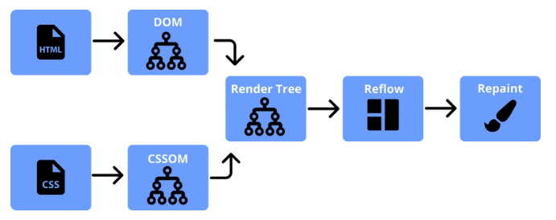
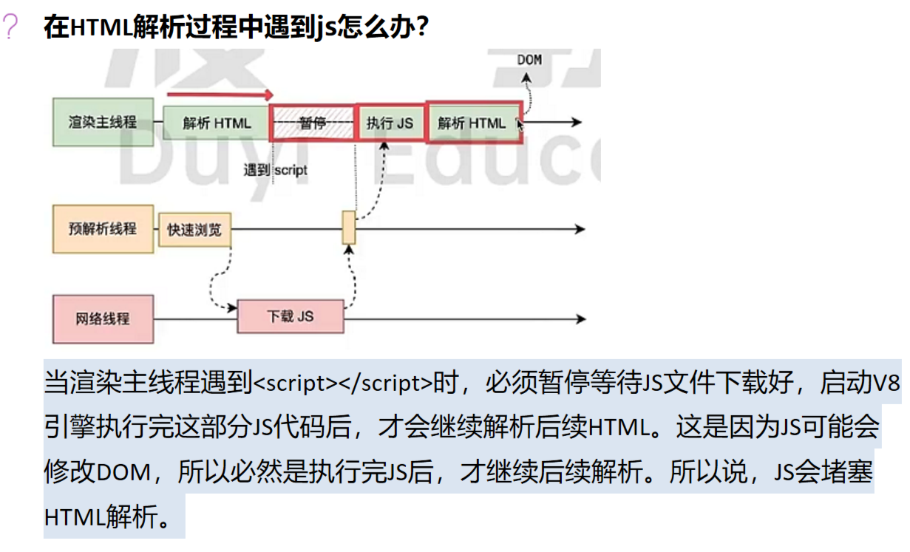
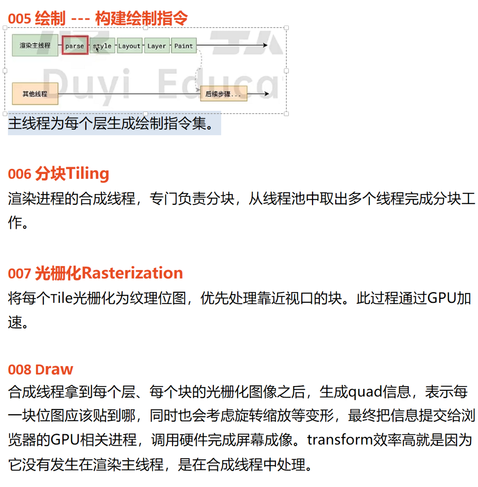

> Reflow和Repaint是影响Web应用性能的重要因素，他们是什么，如何避免？


## 1️⃣ 首先，浏览器是如何呈现一个Web应用的？

### 1. 用户输入URL，浏览器从服务器获取HTML源代码*
  
   👉 浏览器中的网络线程获取到HTML之后，会构建一个渲染任务，并传递给渲染主线程的息队列。在事件循环机制下，渲染主线程取出渲染任务，开始渲染。  
  
  
   
---
### 2. 浏览器解析HTML,  构建DOM树和构建CSSOM树

---
### 3. 合并DOM树和CSSOM树，构建Render树
   1. 从DOM树的根开始，计算哪些元素可见并计算其样式  
   2. 忽略不可见元素，入meta, script, link和display:none  
   3. 将可见节点与CSSOM匹配并应用生产Render节点，最终生成Render树  
   
   👉 CSS属性值的计算过程也就在这个过程，主线程会遍历DOM树，为树的每一个节点计算最终样式ComputedStyle，在这个过程中，一些属性值会变化到绝对单位，比如red-->rgb(255,0,0),比如em,vw,vh--->px。这一步的结果是一个带有样式的DOM

---
### 4. 布局(**Layout**)/重排(**Reflow**) 计算布局树LayoutTree，计算每个节点严格的位置和大小

   👉 布局树和携带计算样式的DOM树并不是一一对应的，布局树中具有严格的几何信息（位置、尺寸）。样式中，display: none \ 伪类元素 \ 滚动条就在DOM树中不存在但在布局树上存在。

---
### 5. 重绘(**Repaint**)在页面上进行绘制，包含分块、光栅化和绘制等过程

   


## 2️⃣更明确一些

### Reflow
👉 Reflow 意味着**重新计算文档中元素的位置和几何图形**，本质是重新计算布局树。
👉 当修改dom元素，修改style属性时，如果影响了布局，就会触发新的布局树计算。元素的 Reflow 将导致 DOM 中所有**子元素和祖先元素的后续重排**,所以重排在**性能方面非常昂贵**，并且是导致 DOM 脚本缓慢的主要原因之一。


#### ❓Reflow是同步发生的还是异步发生的？
为了避免多次布局树计算，浏览器会**合并操作**，当JS运行完之后，把更改进行合并，统一计算。所以说，更改属性造成的reflow是异步完成的。
因此，在修改width之后，再读取clientWidth，必然会立即执行同步的一个重绘任务，方可获取正确的clientWidth，所以说，**在修改属性时，reflow是异步的，在读取属性时，reflow是同步的**


### Repaint
👉 当对元素的外观进行更改时，将发生重绘Repaint，这些更改影响外观，但不改变布局
👉 改动了可见样式时，就需要repaint。
👉 元素布局信息必然是可见样式，reflow一定会触发repaint

---

## 3️⃣具体哪些操作会引发Reflow和Repaint呢
下面的默认重排默认引发后续重绘   

### Cause reflow
1. 对DOM节点的增删改 
2. `display:none`
3. Window Resize
4. font-style 字体
5. 有关大小、位置的修改

### Cause repaint only
1. `visibility: hidden`
2. `color` \ `backgroundColor` 
3. transform 不会触发 Reflow（回流），它只会触发 Repaint（重绘）或 GPU 合成层的更新


## 4️⃣如何减少重排

### 要对元素进行多次修改时，修改类而不是修改属性
将修改合并为一次操作。通过添加/移除 CSS 类来一次性改变多个样式属性，而不是逐个修改。

### 当需要插入一个复杂DOM，或需要进行批量DOM修改时
   1. 使用`documentFragment` 作为根节点，暂存修改
   ```js
      // <ul id="myList"></ul>
      const list = document.getElementById('myList');
      const fragment = document.createDocumentFragment();

      for (let i = 0; i < 100; i++) {
      const li = document.createElement('li');
      li.textContent = 'Item ' + i;
      fragment.appendChild(li);
      }

      // 只触发一次重排
      list.appendChild(fragment);
   ```

   2. 先display:none，使元素脱离渲染流, 修改完毕后，再display:
   ```js
      function updateContent() {
         const container = document.getElementById('container');

         // 1️⃣ 隐藏容器，脱离渲染流
         container.style.display = 'none';

         // 2️⃣ 批量操作 DOM
         for (let i = 0; i < 50; i++) {
            const p = document.createElement('p');
            p.textContent = 'New paragraph ' + i;
            container.appendChild(p);
         }

         // 3️⃣ 修改完后再显示，只触发一次重排
         container.style.display = 'block';
      }
   ```
---

### 页面动画方面，采用transform+opacity创建动画
使用 CSS 动画代替 JavaScript 动画：CSS 动画利用 GPU 加速，在性能方面通常比 JavaScript 动画更高效。使用 CSS 的 transform 和 opacity 属性来创建动画效果，而不是改变元素的布局属性，如宽度、高度等。


## 参考资料
- [Understanding Reflow and Repaint in the browser](https://dev.to/gopal1996/understanding-reflow-and-repaint-in-the-browser-1jbg){target="_blank" rel="noreferrer"}

