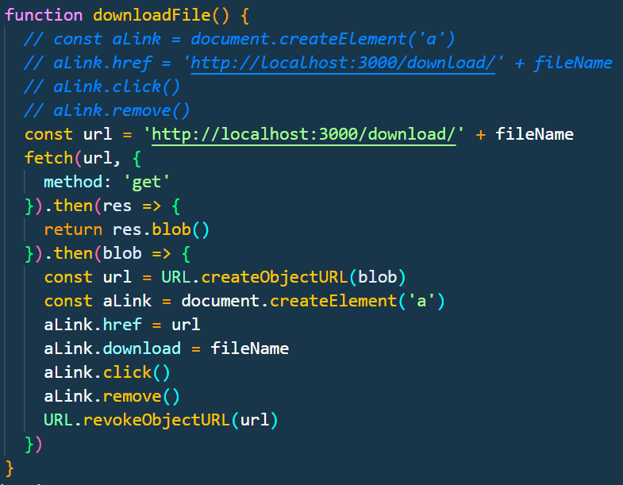

> 文件上传、下载、分片上传下载的实现思路

## 一、文件上传

### 1 简单小文件

**前端**
- input file 标签
- 使用FormData对象, append
- 发起post请求

**后端**

- 解析请求体，拿到文件和表单信息
- 校验文件类型、大小，保存文件
- 返回响应

### 2 分片上传

**分片上传的简化流程：**

- **文件分块**:前端将文件分为多个chunk, 每个chunk有个MD5，整个文件有个MD5
- **文件信息协商**:前端先发个请求，把所有的相关信息(文件MD5、Chunk-MD5、chunk个数等等)发给后端,后端返回需要上传的chunk-MD5列表, 上传过的chunk，则不需要再上传（服务端判断）
- **上传chunk**:前端上传未上传的chunk（并行/串行上传）（chunk上传接口）
- **合并文件**:最终后端所有chunk上传完毕，合并文件（文件合并接口）


## 二、文件下载

###  0 简单的小文件：
> 场景：前端展示某个文件，点击下载，浏览器发一个点击的item的信息给后端，后端收到后，返回一个文件流, 在响应头中加上 `Content-Disposition: attachment; filename="xxx"`，浏览器收到后，即触发下载。

这种场景下，前端不需要做啥处理，全仰仗浏览器。



### 1 大文件，分块下载
> 从Minio上拉文件时，就是分块的，会创建一个.part文件，最终所有分块的文件会合并成一个文件。

> 前后端的文件下载也一样，基于Http-Range请求，前端请求Chunk，后端响应文件块，最后在前端把所有Chunk合并成一个文件，触发浏览器下载。

这个之前在网格编辑器干过，前端分块下载，通过Blob对象，把所有Chunk合并成一个文件，再触发浏览器下载，这种相当于把分块在内存中合并了，如果是GB的东西，这种做法就不合适了。

当时写的旧代码 `FileDownloader.ts` ，后端还比较简单，python open file之后，可以直接根据range请求，返回文件块。

**分片下载的简化流程：**
- **文件Size分块**：获取文件大小，计算chunk个数，初始化chunk数组，确定并发请求数
- **下载阶段**：并发下载chunk，限流并行下载，每个thread专门负责`nowChunkID + this.threadNum`的这些chunck，一个个下载，这个thread任务结束了会标记fulfilled
- **合并阶段**：所有thread任务结束，合并chunk，`URL.createObjectURL`，触发浏览器下载


```ts
import axios from "axios"

/**  
* Example:
* const fileDownloader = new FileDownloader({
*     url: 'http.....',
*     fileName: 'res.zip',
*     chunkSize: 1024 * 1024 * 128,
*     cb: (done: boolean, current: number, total: number) => {
*         if (done) {
*             console.log('Download complete!')
*             return;
*         }
*         console.log(`Downloading... ${Math.round(current / total * 100)}%`)
*     }
* })
* fileDownloader.download()
*/
export default class FileDownloader {

    url: string
    fileName: string
    fileSize: number

    chunks: Array<unknown>
    chunkSize: number
    chunkNum: number
    currentChunk: number

    downloadedSize: number
    abortController: AbortController

    done: boolean
    err: boolean

    callback: Function | null
    intervalID: number | null

    threadNum: number
    fullfilledFlags: Array<boolean>

    constructor({ url, fileName, chunkSize = 64 * 1024 * 1024, threadNum = 4, cb }: {
        url: string,
        fileName: string,
        chunkSize?: number,
        threadNum?: number,
        cb?: Function
    }) {
        this.url = url
        this.done = false
        this.err = false
        this.fileName = fileName
        this.fileSize = 0
        this.chunks = []
        this.chunkNum = 0
        this.chunkSize = chunkSize
        this.currentChunk = 0
        this.downloadedSize = 0
        this.abortController = new AbortController()
        this.callback = cb ? cb : null;
        this.intervalID = null

        this.threadNum = threadNum
        this.fullfilledFlags = []
    }

    getNextChunckID(nowChunkID: number) {
        let nextID = nowChunkID + this.threadNum
        nextID >= this.chunkNum && (nextID = -1)
        return nextID
    }

    async download() {

        console.time("download")

        await this.prepare()
        this.intervalID = window.setInterval(async () => {
            this.callback && this.callback(!(this.downloadedSize < this.fileSize), this.downloadedSize, this.fileSize)
        }, 1000)
        for (let i = 0; i < this.threadNum && i < this.chunkNum; i++) {
            this.downloadChunk(i)
        }
    }

    async prepare() {
        
        try {
            const res = await axios.head(this.url, { signal: this.abortController.signal })
            this.fileSize = parseInt(res.headers['content-length'])
            this.chunkNum = Math.ceil(this.fileSize / this.chunkSize)
            this.chunks = new Array<unknown>(this.chunkNum)
            this.currentChunk = 0
            this.fullfilledFlags = Array.from({ length: Math.min(this.threadNum, this.chunkNum) }, _ => false)

        } catch (e) {
            this.err = true
            this.destroy()
            console.error("FileDownloader Prepare Error:" + e)
        }
    }

    async downloadChunk(chunkIndex: number) {
        try {
            if (this.err) return

            const start = chunkIndex * this.chunkSize
            const end = Math.min(start + this.chunkSize - 1, this.fileSize - 1);
            const res = await axios.get(this.url, {
                headers: { "Range": `bytes=${start}-${end}` },
                responseType: "blob",
                signal: this.abortController.signal
            })

            if (res.status !== 206) throw 'HTTP-Request Error'

            const blob = new Blob([res.data])
            this.chunks[chunkIndex] = blob
            this.downloadedSize += blob.size

            const nextChunkID = this.getNextChunckID(chunkIndex)
            if (nextChunkID != -1) {
                this.downloadChunk(nextChunkID)
            } else {
                const threadID = chunkIndex % this.threadNum // this thread done.
                this.fullfilledFlags[threadID] = true
                // Merge chuncks when all thread done.
                this.fullfilledFlags.every(flag => flag === true) && this.mergeChunks()
            }

        } catch (e) {
            this.err = true
            this.destroy()
            console.error("FileDownloader DownloadChunk Error:" + e)
        }
    }

    mergeChunks() {
        if (this.downloadedSize !== this.fileSize) throw "File size mismatch"
        if (this.err) return

        this.intervalID && clearInterval(this.intervalID)
        const blob = new Blob(this.chunks as BlobPart[]) // Blob合并
        const url = URL.createObjectURL(blob)
        const link = document.createElement('a')
        link.href = url
        link.download = this.fileName
        link.click()
        this.done = true
        setTimeout(() => {
            console.timeEnd("download")
            this.callback && this.callback(true, this.downloadedSize, this.fileSize) // for progress
            link.remove()
            URL.revokeObjectURL(url)
            this.destroy()
        })
    }

    destroy() {

        this.fileName = ''
        this.fileSize = 0
        this.chunks = []
        this.chunkNum = 0
        this.currentChunk = 0
        this.downloadedSize = 0
        this.intervalID && clearInterval(this.intervalID)
        this.abortController.abort()
    }
}

```

