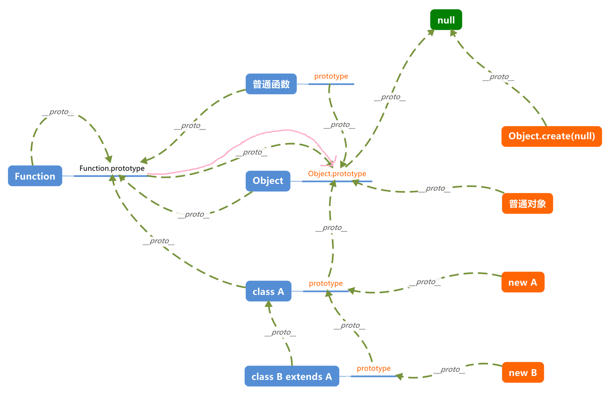

# 继承

大多面向对象的语言，都是采用`class`实现对象继承，而在 JS 中，继承是通过**原型链**实现的。

## 构造函数与原型对象

**➡️构造函数的缺点**:

之前提到，JS 通过构造函数生成新对象，构造函数是对象的**模板**，但是只靠构造函数的话，同一个构造函数生产的多个实例之前**无法共享一些公共属性**，每个实例都是独立的完整的对象，没有复用，造成了资源的浪费。

---

**➡️原型对象**:

为了解决这个痛点，所以引入了原型对象 `prototype`。
**原型对象的所有属性和方法，都能被实例对象共享**。也就是说，如果属性和方法定义在原型上，那么所有实例对象就能共享，节省了内存，实例对象可视为原型对象的派生子对象。

---

**➡️原型链**：

每个对象都有自己的原型对象，可以在`__proto__`属性或`Object.getPrototypeOf()`方法来拿到。


万物皆对象，**所有**对象的原型都能一层层向上追溯到`Object.prototype`，**其值为 `null`**.


这也解释了 JS 如何实现的`boxing`机制，就是因为万物皆对象，且`Object.prototype`上挂载了 `valueOf`与`toString`方法，各个派生对象或派生对象的原型或有或无地对这俩方法进行了重写，对于任何对象都依赖同一接口进行类型转换，由此支撑`boxing`

---

**➡️constructor属性**：

原型对象上有一个`constructor`属性，指向原型对象**所在的**构造函数


`constructor`属性可被继承
```js
function P() { }
const p = new P()

console.log(p.__proto__.constructor === P) // true
console.log(p.constructor === P) // true
```


因此，我们可以从一个实例对象，新建另一个实例对象
```js
const p2 = new p.constructor()
console.log(p2 instanceof P) // true
```

 
**⚠ 注意:**

修改了原型对象的话，通常也会显式修改`constructor`属性。     
当定义一个 JS 函数时，这个函数的`prototype`属性会自动获得一个`constructor`属性，这个属性就指向该函数。     
为什么还要显式指定一下呢，这不是必要的，但是是推荐的, 可以**避免**直接 `Person.prototype = {xxx}`导致的`constructor`**丢失**

```js
function Person(name) {
  this.name = name;
}
Person.prototype.hi = function(){console.log('hello')}
Person.prototype.constructor = Person // 显示指定

const p = new Person('wang')
p.hi()
console.log(p)
```


## 原型链

顺便回顾一下原型链。


注意：**函数也是对象**，下面的例子中，`F` 只是 `Function` 的一个派生对象而已, **`Function` 也是一个对象， 只是 `Object` 的派生对象而已**

```js

function F() { this.n = '' }
var f = new F()

console.log(f.__proto__ === Object.getPrototypeOf(f))

// 从 f 对象出发
console.log(f.__proto__ === F.prototype)
console.log(f.__proto__.__proto__ === Object.prototype)
console.log(f.__proto__.__proto__.__proto__ === null)

console.log('===============================')
// 从 F 构造函数出发, 构造函数其实就是Function的派生实例
console.log(F.__proto__ === Function.prototype)
console.log(F.__proto__.__proto__ === Object.prototype)
console.log(F.__proto__.__proto__.__proto__ === null)
```


[知乎--一图读懂JavaScript原型对象和原型链](https://zhuanlan.zhihu.com/p/54730231)


## instanceof

`instanceof` 判断**对象**是否为某个构造函数的实例, 它会查找对象的**整条原型链**。原始类型会直接false，这里**不会做装箱**。

```js
// 手撕 instanceof

function myInstanceOf(obj, constructor){

    // 原始类型直接返回false
    if(typeof obj !== 'object' || obj === null) return false

    let targetProto = constructor.prototype
    let objProto = obj.__proto__

    // 循环沿原型链向上找
    while(true){

        if(objProto === null) return false
        if(objProto === targetProto) return true
        objProto = objProto.__proto__

    }
}
```

## 继承的实现

在ES6之前，JS 没有 class 关键字，实现继承的方式经过了几代演变，这里主要说几个有用的。

### 组合继承

- 原理：将原型链继承和借用构造函数继承结合起来，既可以继承父类原型上的方法，又可以避免属性共享的问题。
- 优点：每个子类实例有自己的父类属性，互不影响 | 父类原型上的方法可以复用，是比较通用的实现
- 缺点：**父类原型上的方法被调用两次**，一次在原型链继承时，一次在借用构造函数继承时。

---

```js
function Parent() {
  this.name = 'parent';
}

Parent.prototype.sayName = function() {
  console.log(this.name);
}

function Child() {
  Parent.call(this);
  this.type = 'child';
}

Child.prototype = new Parent();
Child.prototype.constructor = Child;

var child = new Child();
child.sayName(); // 'parent'
console.log(child.name); // 'parent'
```


-----

### 寄生组合式继承

这是**最理想的继承方式**，使用`Object.create()`方法来创建**父类原型的副本**，避免了调用父类构造函数时创建不必要的实例。   

- 原理：创建父类原型的一个副本，并将其赋值给子类原型，避免了调用两次父类构造函数。
- 优点：解决了所有组合继承的缺点，**引用类型共享**和**父类构造函数被调用两次**的问题。

```js
function inherit(child, parent) {
  var prototype = Object.create(parent.prototype); // 创建父类原型的一个副本 ！ 隔离
  prototype.constructor = child;
  child.prototype = prototype; // 把副本作为 child 的原型
}

function Parent() {
  this.name = 'parent';
}

Parent.prototype.sayName = function() {
  console.log(this.name);
}

function Child() {
  Parent.call(this);// 只调用1次父类构造函数
  this.type = 'child';
}

inherit(Child, Parent);

var child = new Child();
child.sayName(); // 'parent'
console.log(child.name); // 'parent'
```

-----

### ES6 Class 继承

ES6 引入了 `class` 关键字，但它**本质上仍然是基于寄生组合式继承实现的**。它并没有引入新的继承模型，只是让 JavaScript 的继承写法更接近传统面向对象语言。


`extends` 关键字和 `super` 关键字封装了寄生组合式继承的底层逻辑。


下面的例子，体现了，子类实例对象的原型是**父类原型**的**副本**,可以看到子类重写`afunc`时，父类的 `afunc` 并未改变。
先有个初印象，在学习 ES6 时，再充分学习。
```javascript

class A {
    afunc() {
        console.log('afunc')
    }
    constructor() {
        this.a = 'a'
        // console.log('A constructor')
    }
}

class B extends A {
    b = 'b'

    afunc() {
        console.log('hello')
    }

    bfunc() {
        console.log('bfunc')
    }

    constructor(name) {
        // console.log('B constructor 1')
        super()
        this.name = name
        // console.log('B constructor 2')
    }
}

const b1 = new B('b1')
const b2 = new B('b2')
console.log(b1.afunc) //  afunc() {  console.log('hello') }
console.log(b1.__proto__.afunc, b1.afunc === b1.__proto__.afunc) // true
console.log(b1.__proto__.__proto__.afunc) //  afunc() {  console.log('afunc') }
b1.afunc()


console.log(b1)             // B {a: 'a', b: 'b', name: 'b1'}
console.log(b1.__proto__)   // A {afunc: ƒ, bfunc: ƒ}
console.log(b1.__proto__.__proto__) // {afunc: ƒ}
```
