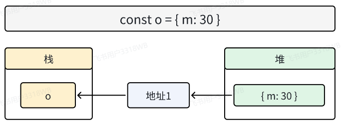

# 对象

## 键 / key / 属性

对象的键名可以是字符串、Symbol，也可以是数字(但是会被转为字符串，访问时也会自动把数字转字符串)

```js
const obj = {
    1: 'he',
    2: 'j'
}
console.log(Object.keys(obj)) // ['1', '2']
console.log(obj[1], obj['1'], obj[1] === obj['1']) // he he true
```

当对象的某个属性仍然是一个对象，不应该视其为嵌套对象，更好的理解是看作是两个对象的**链式引用**的关系，这种链式引用可能出现循环引用，这是在做一些对象操作时需要着重考虑的


## 属性操作

JS 允许属性的“后绑定”，也就是说，你可以在**任意时刻新增属性**，没必要在定义对象的时候，就定义好属性。


下面的例子体现了几个重要点:、
- 属性的访问和赋值，通过`.prop`和`[prop]`两种方式的区别
- 属性的**可枚举性** `enumerable` 决定了在`Object.keys()`和`for in`中能否遍历到这个属性
- `for...in`的**穿透性** ： for...in 会遍历到原型上的key


```js
let prot = { 'name': 'wang' }
let obj = Object.create(prot)
const prop = Symbol()

// 赋值
obj.prop = '123' // 这是给'prop'属性赋值
obj[prop] = '456'// 这是给一个symbol属性赋值，symbol默认是不可迭代属性

// 读取
console.log(Object.keys(obj)) // ['prop']
console.log(Reflect.ownKeys(obj)) // ['prop', Symbol()]   对象本身的所有属性！
for (let key in obj) {
    console.log(key) // prop， name       对象的可枚举属性 + 原型的可枚举属性！
}

console.log(obj.prop, obj['prop'] === obj.prop) // 123 true
console.log(obj[prop]) // 456

// 删除
delete obj[prop]
delete obj['prop']
```


## 对象的引用

