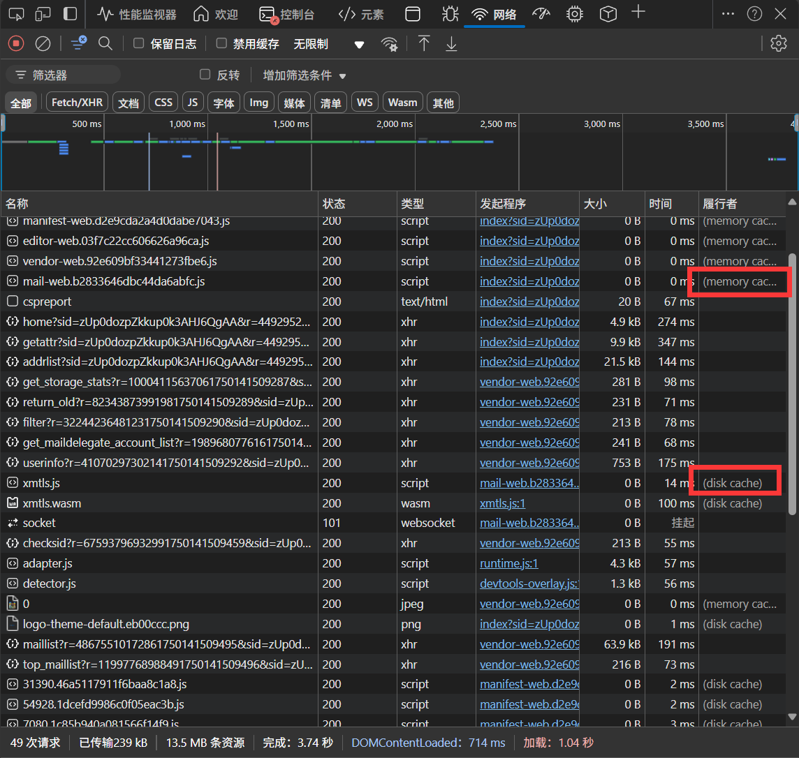
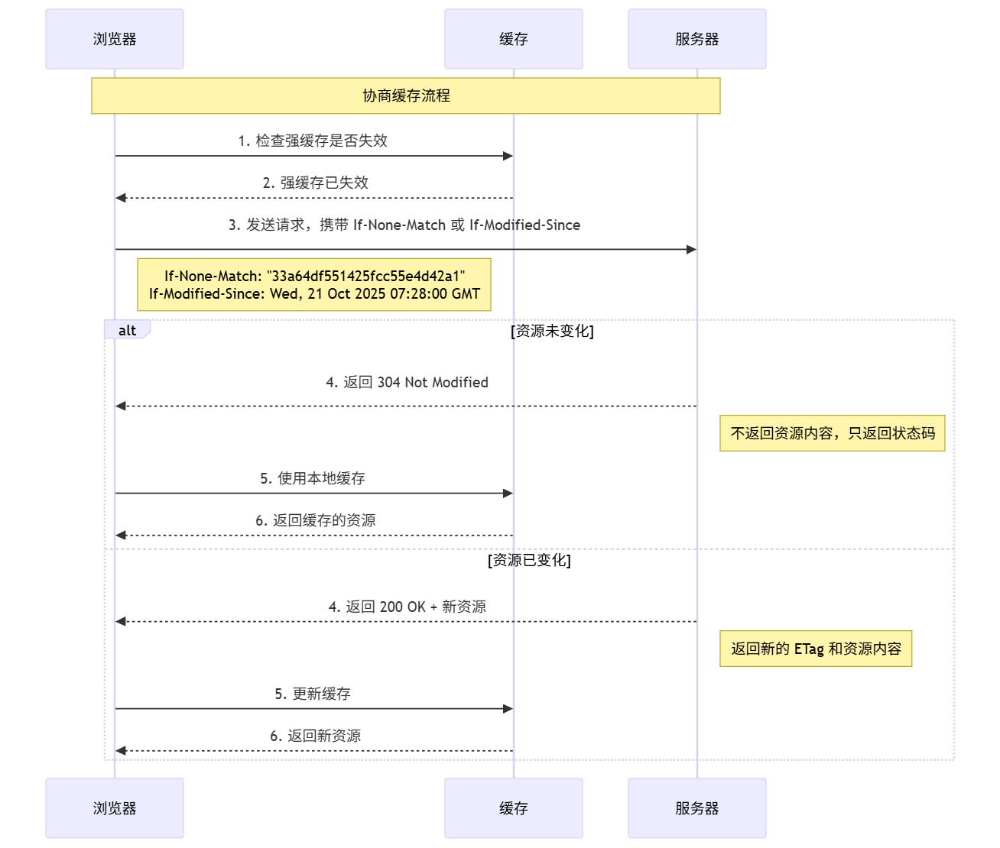

# HTTP 缓存

> HTTP协议驱动的浏览器的默认缓存行为

## 强缓存

>强缓存指的是只要浏览器判断缓存**没有过期**，那就**直接使用**缓存，决定是否使用缓存的**主动性在于浏览器这边。**

### 实现

强缓存是利用下面这两个 HTTP 响应头字段实现的，它们都用来表示资源在客户端缓存的有效期：
- `Expires`，是一个绝对时间； HTTP/1.0
- `Cache-Control`， 是一个相对时间；HTTP/1.1 引入，语义更丰富。

以  Cache-Control 为例：
1. 当浏览器第一次请求访问服务器资源时，服务器会在返回这个资源的同时，在 Response 头部加上 Cache-Control，Cache-Control 中设置了相对过期时间；
2. 浏览器再次请求访问服务器中的该资源时，浏览器自己会先**在发起请求前先判断该资源是否过期**，如果没有，则使用该缓存，否则重新请求服务器；
3. 服务器再次收到请求后，会再次更新 Response 头部的 Cache-Control

### 补充
如果 HTTP 响应头部同时有 Cache-Control 和 Expires 字段的话，**Cache-Control 的优先级高于 Expires**，原因如下：

- **历史兼容性原因**

    - HTTP/1.1 为了兼容旧客户端，规定可以同时返回 `Cache-Control` 和 `Expires`。
        
    - **优先级**：如果两者冲突，**Cache-Control 优先**，因为它是新标准。
        
- **精确性问题**
    
    - `Expires` 使用 **绝对时间**，依赖于客户端和服务器的时钟一致性。
        
        - 如果客户端时间比服务器快，可能导致缓存被提前判定过期。
            
        - 如果慢，就可能错误地继续用旧缓存。
            
    - `Cache-Control` 的 `max-age` 使用 **相对时间**，只和响应到达时的时间戳有关，更可靠。
        
- **功能更强**
    
    - `Expires` 只能控制过期时间。
        
    - `Cache-Control` 可以控制很多行为，比如：
        
        - `no-cache`：必须向服务器验证再用缓存
            
        - `no-store`：完全禁止缓存
            
        - `public` / `private`：区分是否能共享
            
        - `max-age`：相对过期时间
            
        - `s-maxage`：CDN 代理缓存时间
            
    所以在 **规范上就规定 Cache-Control 的权威性更高**。

## 协商缓存

>顾名思义，可以理解为浏览器和服务器协商判断是否使用缓存，判断这个缓存是否使用的主动性在服务端这边。

### 实现

协商缓存可以基于两种头部来实现。

**1‍⃣ 响应头中的 `Last-Modified` + 请求头的 `If-Modified-Since`** 
- 首次请求资源时，200 OK，响应头 `Last-Modified`标示了资源的最后修改时间，浏览器会记下来 📓
- 再次请求资源时，浏览器会把之前记下来的时间附在请求头`If-Modified-Since` ，询问服务器资源是否被修改了？
	- 如果没修改，服务器响应 304 Not Modified，浏览器使用缓存
	- 如果已修改，服务器返回 200 OK 并带来新资源，同时也会附着新的 `Last-Modified` 响应头，重复上面的流程。

**2‍⃣ 响应头的 `ETag` 字段 + 请求头的 `If-None-Match` 字段**
- 规范（RFC 7232）：同一资源内容不变 → ETag 不变；内容变化 → ETag 必须变化
- 类似上面的流程，不过 ETag 可以更准确地明确资源

### 补充
如果首次请求时，服务端返回的 HTTP 响应头部同时有 Etag 和 Last-Modified 字段，那么客户端再下一次请求的时候，如果同时带上了 ETag 和 Last-Modified 字段信息给服务端，**这时 Etag 的优先级更高**，会先基于 ETag 判断，有变化就返回新的，无变化就再检查  Last-Modified，原因如下：

-  **避免误判修改**
	- **Last-Modified 的问题**：某些情况下，文件的修改时间会改变，但文件内容并没有变化，比如：
	    
	    - `touch file.txt` 修改了 mtime，但内容未变；
	    - 系统迁移或备份还原，也可能导致文件时间戳更新。
        
	- **ETag 的优势**：基于内容哈希/版本号，只有内容变了才会变，避免无意义请求。

- **时间粒度不足**
	- **Last-Modified 的问题**：时间精度是 **秒级**。如果一个文件在 1 秒内多次修改，客户端可能无法感知差异。
	    
	- **ETag 的优势**：可以精确到内容的任意细节（字节级），解决秒级精度不足的问题。
- **服务端能力差异**
	- **Last-Modified 的问题**： 并不是所有服务器或存储都能提供“最后修改时间”。
	    
	- **ETag 的优势**：完全由应用层自己控制，可以基于内容、版本号、数据库行号等生成。

## 补充

**协商缓存这两个字段都需要配合强制缓存中 Cache-Control 字段来使用，只有在未能命中强制缓存的时候，才能发起带有协商缓存字段的请求**。

如果限制某个资源一定要走协商缓存，那就 `Cache-Control:no cache`

强缓存适用：
- **几乎不会变的静态资源**
    - 图片、字体、视频、音频
    - 第三方库（例如 React、Vue、lodash 的特定版本）
    - 版本化后的文件（文件名里带 hash 的 JS/CSS：`app.89f3c1.js`），文件名变更 = 强制更新，所以可以安全用强缓存，常见策略是：
    - `Cache-Control: max-age=31536000, immutable`
    （缓存 1 年，immutable 表示即使用户刷新也不请求）    
- **静态站点的资源**
    - 例如 `/favicon.ico`

协商缓存：
- **可能会变化但又不想频繁下载的资源**
    - API 接口返回的 JSON
    - 没有加版本号的 JS/CSS 文件
    - 可能动态生成的 HTML 页面（比如新闻首页）
    
- **需要兼顾实时性和性能的资源**
    - 比如用户头像（可能会换，但不是很频繁）
    - 一些可变的配置文件

- 早期，通常会手动在文件名上加个版本号，如`app.js?v=1.0.0`，当资源有变动时，手动更新版本号，cache miss，客户端也就会请求新的资源。
- 现在的构建工具都会在文件名中间添加hash，如`app.zvjio152.js`，这样可以让客户端大胆缓存资源，当资源有变动时，也会有新的hash，自动请求新的资源。

### 自定义自维护的缓存实现

- Custom Cache: 自己在内存中维护缓存，简单点就是一个Map, 把请求结果或一些重要数据缓存起来，这样做就是Session级的数据缓存，当页面刷新时，缓存会丢失。
- LocalStorage / SessionStorage: 自己维护缓存，但只能存储字符串，容量有限 5MB级，一般用于存储一些简单的且需要持久化的数据。
- IndexedDB：浏览器自带的本地数据库，可以存储结构化数据，支持事务，支持索引，支持查询，支持离线访问，支持同步，但我还没咋用过...