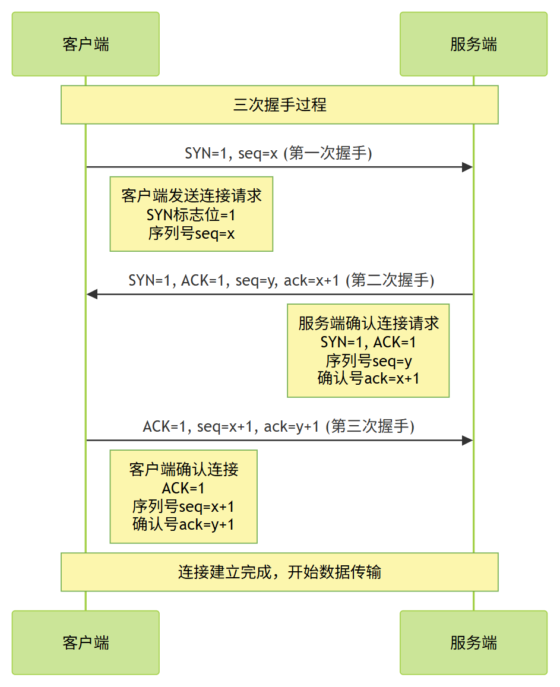
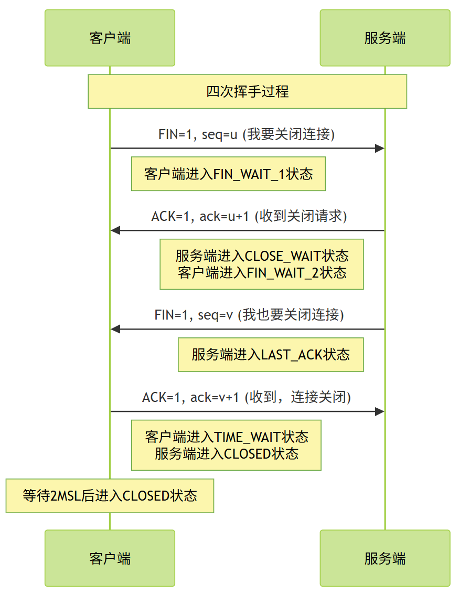

 
> TCP协议是互联网的基石，是互联网的灵魂。三次握手，四次挥手，流控，拥塞控制，是TCP协议的精髓。

## TCP收发数据的流程

回顾五层网络模型，TCP解决的是可靠传输的问题，如何保证可靠传输？

1. 建立连接：三次握手
2. 数据传输：流控，拥塞控制
3. 断开连接：四次挥手

### 1. 建立连接

连接的本质就是双方各自开辟一个Buffer，用于存储数据。
   
三次握手简单说：
- 客户端：我说话你能听见吗
- 服务端：能听见，那我说话你能听见吗
- 客户端：能听见

三次握手具体说：
- 客户端：**SYN=1**(同步序列编号)，seq=x
- 服务端：**SYN=1**(同步序列编号), **ACK=1**(确认编号)，seq=y，ack=x+1
- 客户端：**ACK=1**(确认编号)，seq=x+1，ack=y+1

### 2. 数据传输

#### 分段发送

HTTP中，传输的单位是**报文**，而TCP中，传输的单位是**报文段**。
TCP将HTTP报文拆分成多个报文段，每个报文段都有自己的**编号**和**校验和**，TCP会保证每个报文段都能到达目的地。

#### 可靠传输

在TCP协议中，为了保证数据不缺失(丢包)，数据不乱序、重复，TCP协议要求服务端在收到数据报时必须对数据报进行确认，如果服务端判定丢失/错误，会进行重传。

- 客户端：发送seq(数据报的编号)
- 服务端：收到seq，发送ACK(表示收到seq)和ack(表示收到seq后，下一个seq)
- 客户端：收到ACK后，发送下一个seq

#### 拥塞控制

拥塞控制是TCP协议中的一种机制，用于控制发送方发送数据的速度，防止接收方无法处理过多的数据。

---

**慢启动**
    
慢启动是拥塞控制的一种算法，初始化拥塞窗口(cwnd)为1个报文段，每收到一个ACK，拥塞窗口加1，每经过一个RTT，拥塞窗口加倍。
     
具体表现为，一开始发送速率很慢，传输的数据量很小，一段时间后，发送速率逐渐提高，传输速率达到峰值，网络带宽就会拉高

(网络带宽就是网络的传输速率，比如100M的带宽，就是100Mbps，即100Mb/s，即100Mb/s = 100/8 MB/s = 12. 5MB/s。 注意`Mbps`是`Mbit/s`，不是`MB/s`)

### 3. 断开连接

四次挥手简单说：
- 客户端：我说完了，挂了?
- 服务端：稍等，我还要补充几点....
- 服务端：我说完了，挂了？
- 客户端：好的拜拜

四次挥手具体说：
- 客户端：**FIN=1**(结束标志)，seq=u
- 服务端：**ACK=1**(确认编号)，ack=u+1
- 服务端：**FIN=1**(结束标志)， **ACK=1**(确认编号)，seq=v，ack=u+1
- 客户端：**ACK=1**(确认编号)，ack=v+1

#### TIME_WAIT / 2MSL

在 TCP 四次挥手的最后一步，主动关闭连接的客户端（或者说是先发送 FIN 包的一方）在发送完最终的 ACK 包之后，并不会立即进入`CLOSED`状态，而是会进入一个特殊的`TIME_WAIT`状态，并持续一段时间（通常是 2MSL）。

这里的 MSL (Maximum Segment Lifetime) 指的是一个 IP 数据包在互联网中的最大生存时间。2MSL 意味着是这个数据包从发送端到接收端，再从接收端返回到发送端的最大时间。
    
为的是：  
1. 确保可靠地实现 TCP 全双工连接的终止
  - 如果客户端发送的 ACK 包丢失，服务器会超时重传 FIN 包，客户端在 TIME_WAIT 状态下，如果收到服务器重传的 FIN 包，它会重新发送一次最终的 ACK 包，并重置 TIME_WAIT 计时器。这确保了服务器最终能收到 ACK，并正常进入 CLOSED 状态，从而实现了连接的平滑、可靠关闭。

2. 防止“旧连接”的延迟数据包干扰“新连接”
  - 如果在关闭后，立即建立相同IP端口的连接，可能会收到之前连接的延迟数据包，导致数据错乱。所以TIME_WAIT状态确保了在网络中所有与旧连接相关的所有数据包都已经彻底消失

## 思考

1. 为什么TCP协议是可靠的？
1. 讲讲三次握手
2. 讲讲四次挥手
3. 讲讲四次挥手中2MSL的作用（TIME_WAIT状态的作用）
5. HTTP和TCP的区别和联系是什么？
   - HTTP是应用层协议，做的是消息格式的规定
   - TCP是传输层协议，负责消息的可靠传输
   - HTTP是基于TCP的，一次HTTP请求-响应过程，包括建立连接、完成请求和响应、断开连接，所以说HTTP请求是无状态的