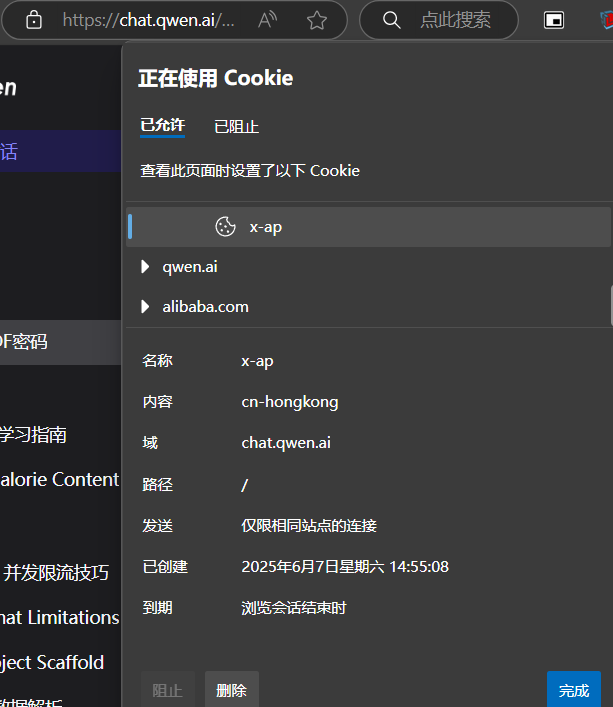
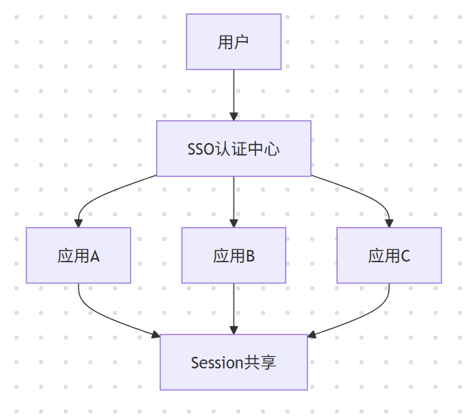

> 登录这个东西，进组的时候都说学前后端，懂登录就可以干活🌶，实现登录倒是简单，安全登录就需要考虑很多了，这篇捋一捋Cookie、Session、SSO、LocalStorage、SessionStorage这些东西

## Intro

客户端和服务器的认证问题:         
客户端与服务器的交互基于HTTP协议，HTTP协议是**无状态**的，即服务器**无法区分**两次请求是否来自同一个客户端。
      
解决方案：    
**身份凭证**客户端登录成功后，服务器返回一个**身份凭证**，客户端**保存**这个凭证 (LocalStorage)，再向服务器发送请求时，携带这个凭证。
      
---

带来的问题：   
用户会浏览登录众多网页，客户端会保存许多的身份凭证，所以需要有一个**卡包**，能够做到：
  1. 保存多个身份凭证：不同网站的凭证，同一网站的多个凭证
  2. 能够根据域名来区分不同的身份凭证：用户访问时，能够自动携带正确的凭证
  3. 能够知道过期时间：过期后，卡包会自动删除凭证
     
Cookie机制就是这样一个**卡包**，它能够保存多个身份凭证，能够自动管理这些凭证。  

## Cookie的组成

每个Cookie时某个网站的一个卡片，记录了：
- key: 名称
- value: 内容
- domain: 域
- path: 路径
- secure: 是否使用安全传输
- expires: 过期时间

---

当浏览器像服务器发送请求时，他会自动携带合适的Cookie。

如果Cookie同时满足以下，则会被附带到请求中去：

- 没有过期

- 域匹配
  - 域匹配：baidu.com 和 www.baidu.com / news.baidu.com 都匹配
  - 不在乎端口，域匹配即可

- 路径匹配
  - 路径匹配：/ 和 /index.html 都匹配
  - 不在乎参数，基路径匹配即可

- 安全传输
  - 如果Cookie设置了secure，则只有https才能传输

通过以上规则的Cookie，会以`{key}={value};{key2}={value2};...`的形式附带到请求中去。

## Cookie的设置

1. 服务端设置Cookie

  - 服务端可以在响应头中设置Cookie且可以一次设置多个
    - `Set-Cookie: cookie1` 
    - `Set-Cookie: cookie2`
  
  - 每个Cookie的格式为：`{key}={value};path={path};domain={domain};max-age={max-age};expires={expires};secure;httponly;`
    - 其中，key和value是必须的，其他都是可选的
    - path、domain:如果不设置，则默认是当前域和路径
    - 设置过期时间，`max-age`单位是秒, `expires`设置绝对过期时间，没设置的话，默认是浏览器会话结束（关闭浏览器）
    - httponly: 设置后，客户端无法通过JS访问Cookie，只能通过HTTP请求访问
  
  - 当这样的响应头到达客户端浏览器后，浏览器会自动将Cookie保存到卡包中，存在key则更新，不存在则创建

  - 删除Cookie，通过修改Cookie实现
    - 设置过期时间，设置为过去的时间 `max-age=-1`
    - 在删除时，需要同时检验`key`,`path`和`domain`,光靠key无法唯一确定一个Cookie

2. 客户端设置Cookie

  - 通过JS设置Cookie
    - `document.cookie = "{key}={value};path={path};domain={domain};max-age={max-age};expires={expires};secure;httponly;"`
    - 设置后，浏览器会自动将Cookie保存到卡包中，存在key则更新，不存在则创建

  - 通过JS删除Cookie
    - `document.cookie = "key=;path=/;domain=baidu.com;max-age=0;secure;httponly;"`
    - 设置后，浏览器会自动将Cookie删除

  - 通过JS获取Cookie
    - `document.cookie` 返回所有Cookie，格式为`{key}={value};{key2}={value2};...`

## LocalStorage SessionStorage and Cookie

cookie、localStorage、sessionStorage都是浏览器存储数据，但它们有不同的特点和用途。

1. Cookie:
  - **兼容性较好**，所有浏览器都支持，并且浏览器针对Cookie**有**一些默认行为，比如：
    - 响应头中有`Set-Cookie`，浏览器会自动保存Cookie
    - 浏览器发送请求时，会附带匹配的Cookie
  - 正是因为这些特性，Cookie一直担任着维护用户状态的重任

  - 但也因为这些默认行为，Cookie被用来进行恶意攻击,跨站请求伪造(CSRF)，恶意网站可以利用Cookie伪造用户请求
    - 比如你登录银行网站，又不小心访问了恶意网站，恶意网站可以利用你的Cookie伪造请求，像银行服务器发请求把钱转走

  - 最佳实践
    - `SameSite=Strict/Lax`（防 CSRF）
    - `HttpOnly`（防 XSS）
    - `Secure`（HTTPS）

2. LocalStorage 和 SessionStorage:
  - **HTML5 新增**了这两个API，浏览器针对他们**没有默认行为**，所有保存、操作和携带都需要前端实现。
  - LocalStorage用于持久化保存数据，关闭浏览器后**仍然存在**，除非手动删除
  - SessionStorage用于保存会话临时数据，**标签页关闭时清除**
    
3. 容量：
  - Cookie: ~4KB/每个域名
  - LocalStorage: 5MB-10MB/每个域名
  - SessionStorage: 5MB/每个标签页

## Session

### 机制
Cookie可以把一些信息保存到客户端，但是这些信息是**明文保存**的，敏感信息不能存下来。
    
总不能把用户的账号密码都放Cookie里，携带着发叭...
    
Session机制就是**服务端的保险柜**，在服务端**存储**用户会话信息，客户端仅需要保存一个**Session ID**，每次请求时，携带这个ID，服务器根据ID**查找**对应的会话信息。

### 实现
    
在后端，通常使用`Redis`或数据库保存Session数据，需要设置过期时间，过期后，Session ID会失效，需要重新登录。

在前端，通常使用`Cookie`保存Session ID，基于响应头的`Set-Cookie`字段，**自动**设置`SID`，每次请求时，**自动**携带这个ID，服务器根据ID解密信息。

### Session 的生命周期

**1. 创建阶段**
- **时机**：用户首次登录成功后
- **过程**：
  - 服务器生成唯一的 Session ID（通常使用UUID或随机字符串）
  - 在服务器端存储用户会话信息（如用户ID、登录时间、权限等）
  - 通过 `Set-Cookie` 将 Session ID 发送给客户端

**2. 活跃阶段**
- **持续时间**：从创建到过期或销毁
- **特点**：
  - 每次请求都会携带 Session ID
  - 服务器验证 Session ID 的有效性
  - 可以更新 Session 数据（如最后访问时间）

**3. 过期机制**
- **时间过期**：服务端响应头设置 `max-age` 或 `expires`
- **不活跃过期**：超过指定时间未访问自动失效
- **主动销毁**：用户登出时主动删除

**4. 销毁阶段**
- **时机**：过期、登出、服务器重启
- **清理**：服务器端删除Session数据，客户端删除Cookie

**如何销毁？**
- 服务端：
  - 设置过期时间
  - 服务器重启时删除
- 客户端：
  - 用户登出时主动删除`logOut行为`,`unload事件`
  - 删除Cookie

### 分布式Session 共享

在**分布式系统**中，用户请求可能被负载均衡器分发到不同的服务器节点，导致Session数据无法共享。解决方案有以下几种：

1. Session 复制
- **原理**：将Session数据在所有服务器节点间同步复制
- **优点**：数据一致性好
- **缺点**：网络开销大，扩展性差

2. Session 粘性（Sticky Session）
- **原理**：负载均衡器根据Session ID将用户请求固定到特定服务器
- **优点**：实现简单，性能好
- **缺点**：服务器故障时Session丢失，负载不均

3. 集中式 Session 存储 ⭐
- **原理**：使用Redis、Memcached等集中存储Session数据
- **优点**：
  - 所有服务器共享Session数据
  - 高可用性和可扩展性
  - 支持Session持久化
- **缺点**：依赖外部存储服务

### SSO（单点登录）

**单点登录**  |  `Single Sign On`  | `SSO`
    
场景：你在登录谷歌后，可以访问谷歌的多个服务，比如Gmail、YouTube、Google Drive、Google Calendar。

#### 概念区别

**分布式Session共享**：
- **问题**：同一应用的不同服务器节点间共享用户会话
- **场景**：一个网站有多个服务器，用户请求可能被分发到不同服务器
- **目标**：确保用户在任何服务器上都能保持登录状态

**SSO（单点登录）**：
- **问题**：不同应用/系统间共享用户身份认证
- **场景**：用户登录一个系统后，可以访问其他相关系统而无需重复登录
- **目标**：一次登录，多处使用

#### SSO 依赖于 Session 共享

#### 实现流程

**OAuth2** 授权码模式
- 1. 用户访问应用A
- 2. **重定向**到SSO认证中心，认证中心维护了一个统一的用户信息库
- 3. 用户登录成功，获得授权码
- 4. 应用A用授权码换取访问令牌
- 5. 应用A验证令牌，创建本地Session

## 思考：·
1. 为什么需要Cookie
2. Cookie的更新规则
3. LocalStorage和SessionStorage的区别，他们和Cookie的区别，解决了什么问题？
4. Session 是什么？解决啥问题？
5. 以用户登录为场景，描述Session的生命周期和相关实现。
6. 分布式Session 共享的解决方案有哪些？
7. SSO 是什么？解决啥问题？